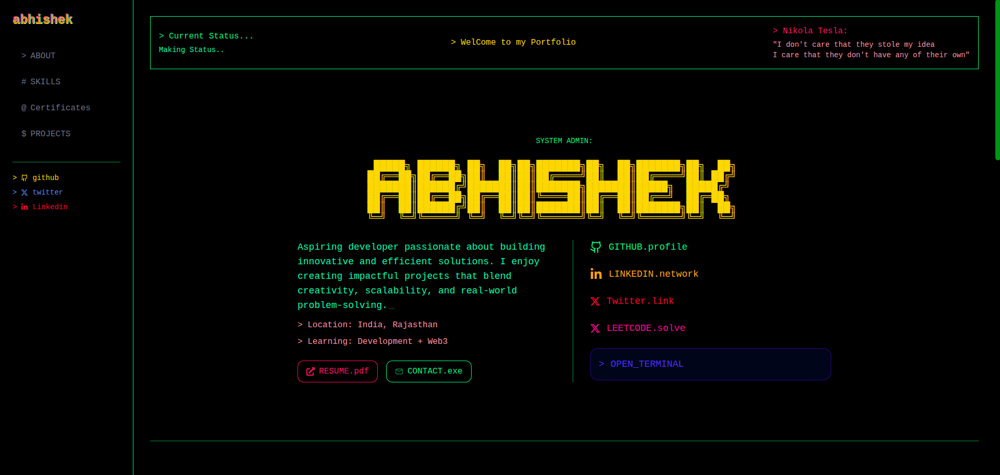
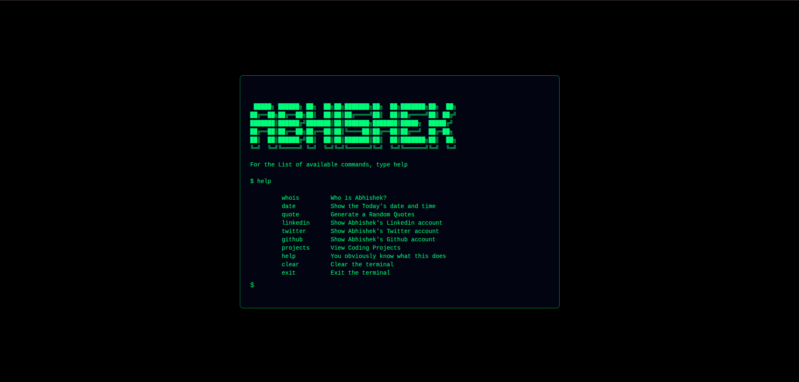

# Terminal Portfolio 🚀

A **terminal-style personal portfolio website**, designed to look and feel like a real terminal. Built with React and Tailwind CSS.




---

## ✨ Features

- Fully responsive, terminal-like interface
- Command-line inspired user experience
- Smooth animations with Framer Motion
- Easily customizable commands and personal info
- Built with **React**, **TypeScript**, and **Tailwind CSS**

---

## 📁 Tech Stack

- ⚛️ React
- 💨 Tailwind CSS
- 🎨 Framer Motion (for subtle animations)
- 🛠️ TypeScript (optional, remove if not used)

---

## 📦 Getting Started

1. **Clone the repo**

   ```bash
   git clone https://github.com/your-username/terminal-portfolio.git
   cd terminal-portfolio
   ```

2. **Install dependencies**
   npm install

3. **Start for development server**
   npm run dev
